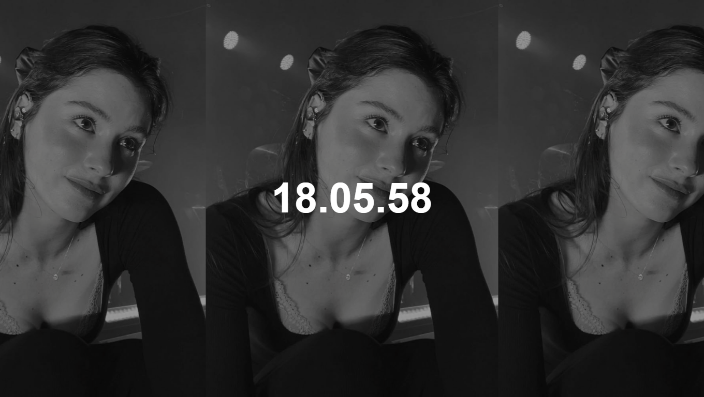

# The Gracie Clock

"Don't just watch the clock, watch it with Gracie Abrams."

A simple and aesthetic web clock that features a rotating gallery of Gracie Abrams images.

## Live Demo
You can see the project running at: [gracie-clock.pages.dev](https://gracie-clock.pages.dev)

## Features
- **Dynamic Clock**: Always stay on time with a clean, digital display.
- **Image Gallery**: A new Gracie Abrams image every second.
- **Full Screen Mode**: Click the icon to enter full screen for a more immersive experience.
- **Lightweight**: Built with pure HTML, CSS, and Vanilla JavaScript.

## How to use
Simply download and open `index.html` in your browser or visit the live link.

## Author
Created by [Oli](https://olivermartinezharo.com/es).
